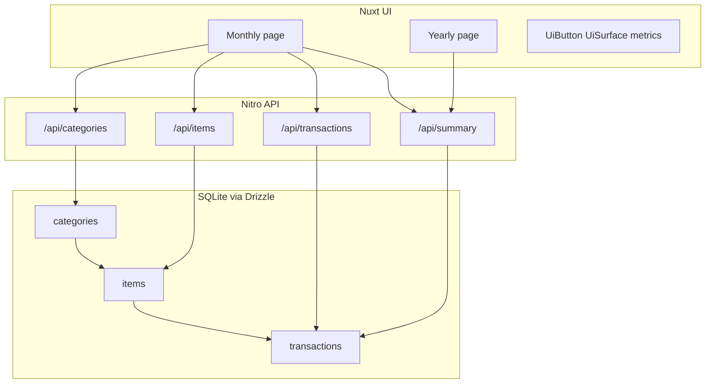
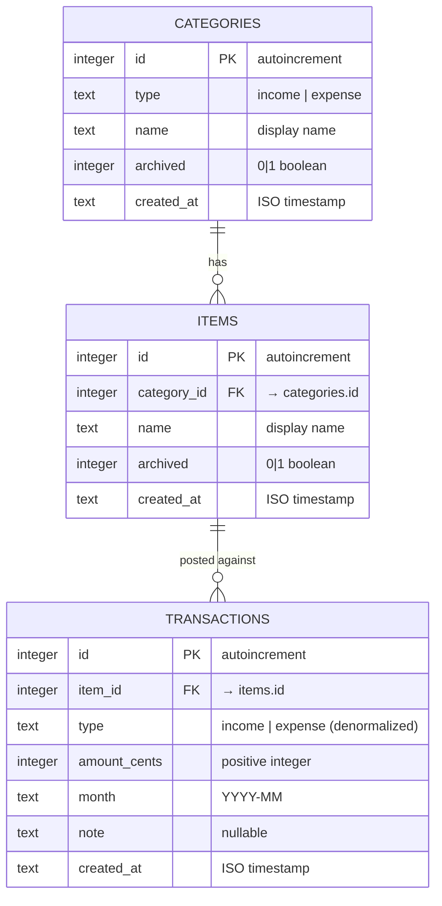

# Income & expense tracker architecture

## Purpose

Local Nuxt 4 application that records personal income/expense transactions against a three-level classification (type → category → item) and presents monthly and yearly aggregations.

## Context



## Components

| Component | Responsibility | Interface |
|---|---|---|
| `app/pages/month/**` | Monthly metrics, manage panel, bulk entry, grouped list + edit | HTTP `/api/*` |
| `app/pages/year/**` | Year summary + pivots | `/api/summary/yearly` |
| `server/api/**` | CRUD + bulk partial writes + summaries | Zod-validated JSON |
| `server/db/**` | Schema, client, seed | SQLite file `.data/tracker.db` |
| `server/utils/aggregate.ts` | Month totals + pivots (skips invalid month keys) | Pure functions |

## Data flow

1. UI loads categories/items/transactions/summary for the selected month or year.
2. Writes go through Zod validation; bulk writes validate per row.
3. Summaries aggregate persisted rows; CHECK constraints reject invalid type/amount/month at the DB layer.

## Data model

Persistent state is a single local SQLite database (`.data/tracker.db`) owned by Drizzle migrations under `drizzle/`. Source of truth for column types and constraints is `server/db/schema.ts`.

### Conceptual design

Classification is three levels deep. A **type** (`income` | `expense`) partitions **categories**. Each category owns **items** (the accounts/sources a user actually posts against). Every **transaction** references an item — never a category directly — and is scoped to a calendar **month** (`YYYY-MM`), not a day.

```text
type (income | expense)
  └── category  (e.g. Salary, Credit Card)
        └── item  (e.g. Salary James, Amex Credit Card)
              └── transaction  (amount_cents, month, optional note)
```

### ERD



### Relationships

| From | To | Cardinality | Rule |
|---|---|---|---|
| `categories` | `items` | 1 : N | `items.category_id` → `categories.id`; ON DELETE/UPDATE no action |
| `items` | `transactions` | 1 : N | `transactions.item_id` → `items.id`; ON DELETE/UPDATE no action |

### Data dictionary

#### `categories`

User-managed grouping under a fixed type. Type cannot be changed after create (archive + recreate instead).

| Column | SQLite type | Null | Default | Constraints | Description |
|---|---|---|---|---|---|
| `id` | INTEGER | NO | autoincrement | PRIMARY KEY | Surrogate key |
| `type` | TEXT | NO | — | CHECK `IN ('income','expense')` | Ledger side; immutable after insert |
| `name` | TEXT | NO | — | UNIQUE with `type` (`categories_type_name_idx`) | Display name within type |
| `archived` | INTEGER | NO | `false` (0) | boolean mode | When true, excluded from new-entry selectors; history kept |
| `created_at` | TEXT | NO | `current_timestamp` | — | Insert timestamp |

#### `items`

Concrete account/source under a category. Type is inherited from the parent category and must match `transactions.type` on write.

| Column | SQLite type | Null | Default | Constraints | Description |
|---|---|---|---|---|---|
| `id` | INTEGER | NO | autoincrement | PRIMARY KEY | Surrogate key |
| `category_id` | INTEGER | NO | — | FK → `categories.id` | Owning category |
| `name` | TEXT | NO | — | UNIQUE with `category_id` (`items_category_name_idx`) | Display name within category |
| `archived` | INTEGER | NO | `false` (0) | boolean mode | When true, excluded from new-entry selectors; history kept |
| `created_at` | TEXT | NO | `current_timestamp` | — | Insert timestamp |

#### `transactions`

Month-scoped money movement against an item. Amounts are stored as integer cents (not floating-point dollars) to keep money math exact.

| Column | SQLite type | Null | Default | Constraints | Description |
|---|---|---|---|---|---|
| `id` | INTEGER | NO | autoincrement | PRIMARY KEY | Surrogate key |
| `item_id` | INTEGER | NO | — | FK → `items.id` | Posted item |
| `type` | TEXT | NO | — | CHECK `IN ('income','expense')` | Denormalized; must equal parent category type |
| `amount_cents` | INTEGER | NO | — | CHECK `> 0` | Absolute amount in cents (`10050` = $100.50; `9598` = $95.98) |
| `month` | TEXT | NO | — | CHECK length 7, `YYYY-MM`, month 01–12, year 1900–2100 | Accounting period |
| `note` | TEXT | YES | — | — | Optional free text |
| `created_at` | TEXT | NO | `current_timestamp` | — | Insert timestamp |

### Invariants

- A transaction’s `type` must match its item’s category `type` (enforced in API; CHECK enforces enum only).
- Archived categories/items remain readable for historical totals but are rejected on new/updated writes.
- Invalid month strings are rejected at insert (CHECK) and skipped defensively by yearly aggregators.
- Unique names are scoped: category names per type; item names per category.
- Currency is represented as integer cents to avoid floating-point precision errors in totals and pivots.

### Persistence & migrations

| Artifact | Role |
|---|---|
| `server/db/schema.ts` | Drizzle schema + TypeScript types |
| `drizzle/0000_worthless_runaways.sql` | Initial tables, FKs, unique indexes |
| `drizzle/0001_calm_molecule_man.sql` | CHECK constraints on type, amount, month |
| `docs/migrations/income-expense-tracker.md` | Migration plan + seed profile |

## Boundaries and non-goals

- No auth, multi-tenancy, or hosted deployment in v1.
- No day-level dates; month is the grain of record.
- Prior branch `feat/001-income-expense-tracker` used a flatter model and is not the architecture of record.

## Related docs

- Spec: `docs/specs/income-expense-tracker.md`
- UI design: `docs/design/income-expense-tracker.md`
- Migration plan: `docs/migrations/income-expense-tracker.md`
- API contract: `docs/api/income-expense-tracker.md`
