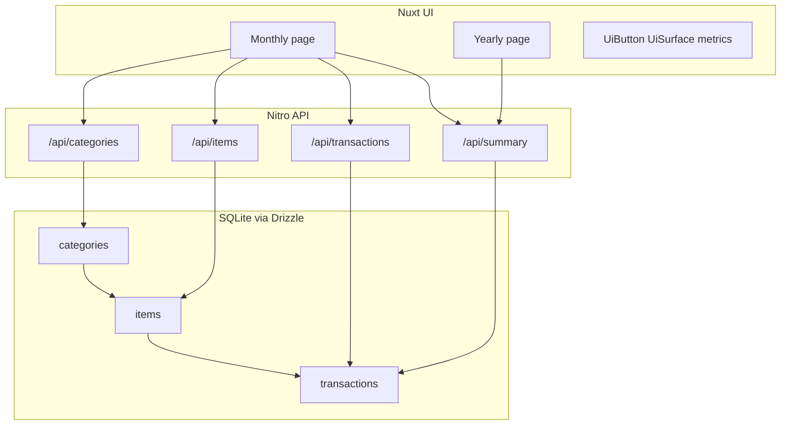

# Income & expense tracker architecture

## Purpose

Local Nuxt 4 application that records personal income/expense transactions against a three-level classification (type → category → item) and presents monthly and yearly aggregations.

## Context

## Components

| Component | Responsibility | Interface |
|---|---|---|
| `app/pages/month/**` | Monthly metrics, manage panel, bulk entry, grouped list + edit | HTTP `/api/*` |
| `app/pages/year/**` | Year summary + pivots | `/api/summary/yearly` |
| `server/api/**` | CRUD + bulk partial writes + summaries | Zod-validated JSON |
| `server/db/**` | Schema, client, seed | SQLite file `.data/tracker.db` |
| `server/utils/aggregate.ts` | Month totals + pivots (skips invalid month keys) | Pure functions |

## Data flow

1. UI loads categories/items/transactions/summary for the selected month or year.
2. Writes go through Zod validation; bulk writes validate per row.
3. Summaries aggregate persisted rows; CHECK constraints reject invalid type/amount/month at the DB layer.

## Boundaries and non-goals

- No auth, multi-tenancy, or hosted deployment in v1.
- No day-level dates; month is the grain of record.
- Prior branch `feat/001-income-expense-tracker` used a flatter model and is not the architecture of record.

## Related docs

- Spec: `docs/specs/income-expense-tracker.md`
- UI design: `docs/design/income-expense-tracker.md`
- Migration plan: `docs/migrations/income-expense-tracker.md`
- API contract: `docs/api/income-expense-tracker.md`
