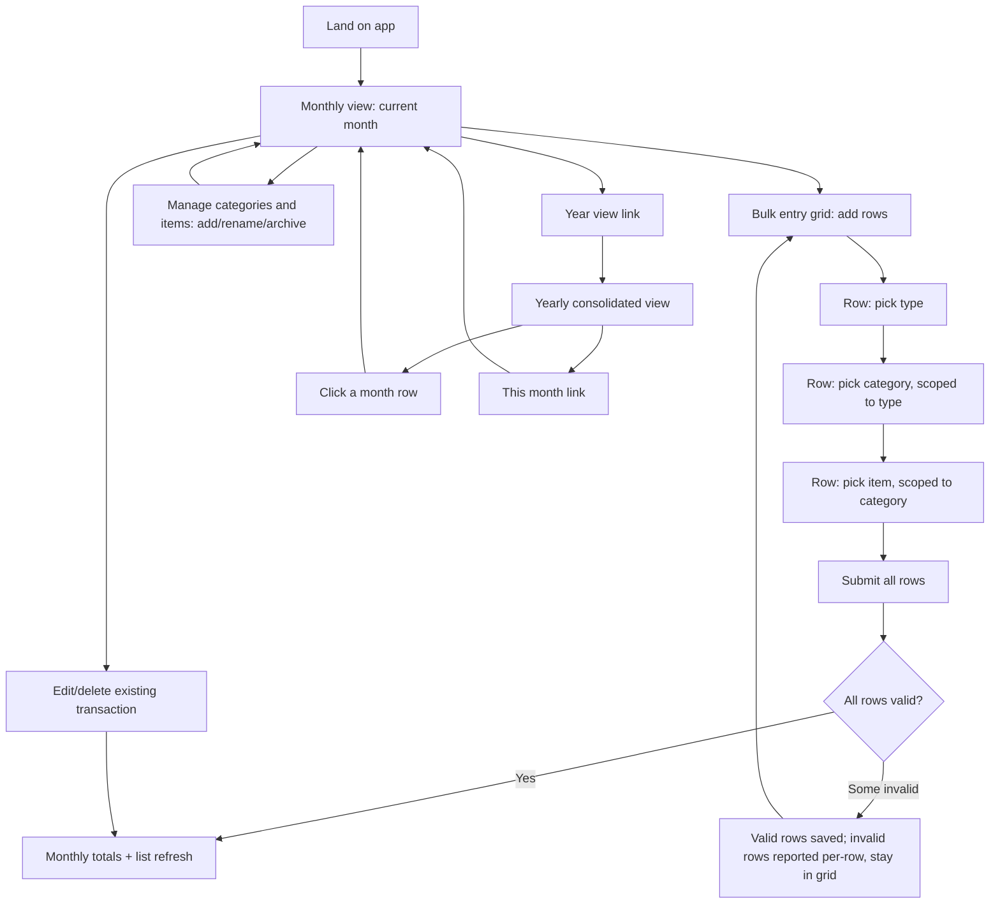

# Design: Monthly and yearly income/expense tracking

## User goal

Record income and expenses against a specific item (a real account/source, e.g. "RBC MC" under category "Credit Card") for a given month, enter several transactions at once without repeated form round-trips, and see both a monthly breakdown and a yearly consolidated view without doing any arithmetic by hand.

## Flow



## Screens

### Monthly view (`/month/:year/:month`)

```
+--------------------------------------------------------------------------+
| Income & Expense Tracker                       [This month] [This year] |
+--------------------------------------------------------------------------+
| July 2026                                   [< Prev]  [Next >] [Year]    |
| Income: $0.00   Expenses: $57.80   Net: -$57.80                          |
| > Manage categories & items                                              |
+--------------------------------------------------------------------------+
| Add transactions (bulk grid)                                             |
| Month   | Type    | Category    | Item          | Amount | Note | [x]    |
| 2026-07 | Expense | [select v]  | [select v]    | 0.00   |      | Remove |
| 2026-07 | Expense | [select v]  | [select v]    | 0.00   |      | Remove |
| 2026-07 | Expense | [select v]  | [select v]    | 0.00   |      | Remove |
| [+ Add row]                                              [Save all rows]|
+--------------------------------------------------------------------------+
| Transactions this month                                                  |
| Month   | Category    | Item          | Type    | Amount | Note | [x]    |
| 2026-07 | Credit Card | Amex Credit Card | expense | $45.50 |    | Delete |
| 2026-07 | Credit Card | RBC MC          | expense | $12.30 |    | Delete |
+--------------------------------------------------------------------------+
```

- The **Month** field is a native `<input type="month">` — it returns a `YYYY-MM` value directly, with no day-of-month captured anywhere in the app. It defaults to the page's own year/month, since the grid lives on a specific monthly view; a user could still change it per-row to log a transaction into an adjacent month without navigating away, but there is no calendar/day picker at any point.
- **Category** options depend on the row's **Type** (income rows only offer Salary/Rental/Dividend/Interest-style categories; expense rows only offer Credit Card/Utilities/Line Of Credit-style categories). Changing Type resets Category and Item on that row.
- **Item** options depend on the row's selected **Category** (e.g. Category "Credit Card" → Items "Amex Credit Card", "RBC MC"). Changing Category resets Item on that row. A row with no Category selected shows a disabled/empty Item selector.
- "Manage categories & items" is a collapsible panel: pick a type (income/expense) to see its categories; each category expands to show its items; each category and item has an Archive/Unarchive toggle and its own "add" input.
- The bulk grid starts with three blank rows, defaulted to the page's month and "Expense" type. Rows with no item selected or no amount entered are silently skipped on submit (not reported as errors — an intentionally blank row is not a mistake).
- A row with an item selected AND an amount entered, but that fails server-side validation (archived item, item/type mismatch), is reported per-row and remains editable in the grid; rows that succeeded are removed from the grid and appear in the transaction list below.

### Yearly view (`/year/:year`)

```
+--------------------------------------------------------------------------+
| Income & Expense Tracker                       [This month] [This year] |
+--------------------------------------------------------------------------+
| 2026 -- Yearly summary                              [< 2025]  [2027 >]  |
| Year income: $37,950.00  Year expenses: $1,898.27  Net: ...             |
+--------------------------------------------------------------------------+
| Month     | Income     | Expenses  | Net        |                       |
| January   | $12,650.00 | $613.49   | $12,036.51 | (link)                |
| ...       | ...        | ...       | ...        |                       |
| Total     | $37,950.00 | $1,898.27 | $36,051.73 |                       |
+--------------------------------------------------------------------------+
| Income detail                                                            |
|                    | Jan   | Feb   | Mar   | ... | Dec   | Total          |
| Salary                                                                    |
|   Salary James     | 5,500 | 5,500 | 5,500 | ... | 5,500 | 66,000         |
|   Salary Amy       | 4,800 | 4,800 | 4,800 | ... | 4,800 | 57,600         |
|   Salary subtotal  | 10,300| 10,300| 10,300| ... | 10,300| 123,600        |
| Rental                                                                    |
|   Rental Unit 1    | 2,200 | 2,200 | ...   |     | 2,200 | 26,400         |
|   Rental subtotal  | 2,200 | 2,200 | ...   |     | 2,200 | 26,400         |
| Dividend                                                                  |
|   Dividend TD      |   150 |   150 | ...   |     |   150 | 1,800          |
|   Dividend subtotal|   150 |   150 | ...   |     |   150 | 1,800          |
| Interest                                                                  |
|   Interest subtotal|     0 |     0 | ...   |     |     0 | 0              |
| Income total       | 12,650| 12,650| ...   |     | 12,650| 151,800        |
+--------------------------------------------------------------------------+
| Expense detail                                                           |
|                    | Jan   | Feb   | Mar   | ... | Dec   | Total          |
| Credit Card                                                               |
|   Amex Credit Card |   426 |   426 | ...   |     |   426 | 5,112          |
|   RBC MC           |   188 |   188 | ...   |     |   188 | 2,256          |
|   Credit Card subtl|   613 |   613 | ...   |     |   613 | 7,368          |
| Utilities                                                                 |
|   Utilities subtl  |     0 |     0 | ...   |     |     0 | 0              |
| Line Of Credit                                                            |
|   LOC subtotal     |     0 |     0 | ...   |     |     0 | 0              |
| Expense total       |   613 |   613 | ...   |     |   613 | 7,368          |
+--------------------------------------------------------------------------+
```

- Each month name in the top summary table links to that month's monthly view.
- The detail section is split into two blocks, Income and Expense, each a pivot table: rows are items grouped under their category, columns are the twelve months of the selected year plus a row/column Total. Each category has a subtotal row (sum of its items) directly below its item rows; each type block ends with a type-total row (Income total / Expense total) matching the top summary's income/expense figures for cross-check.
- A category with no items yet (e.g. Interest, Utilities, Line Of Credit in the starter seed) still renders its subtotal row at zero — it is not hidden, since the user may add items to it later and the row is a stable place for that data to appear.
- Archived categories/items with a non-zero total anywhere in the year still appear (see States below); archived ones with an all-zero year are omitted to keep the table from growing unbounded over time.

## States

| State | User sees | Available actions |
|---|---|---|
| Empty month | Zeroed totals ($0.00 everywhere), "No transactions recorded for this month yet." in place of the table | Add via bulk grid |
| Empty year | Zeroed totals for every month row | Navigate to any month to add data |
| No category selected (grid row) | Item selector disabled/empty | Pick a category first |
| Loading | Browser-native page transition (no client-side spinner needed at this data scale) | Wait |
| Bulk entry success (all rows valid) | Grid resets to 3 blank rows; transaction list and totals update immediately | Add more rows |
| Bulk entry partial failure | Failed rows' error text shown above the grid ("Row 2: Item is archived"); failed rows stay editable; succeeded rows disappear from the grid and appear in the list below | Fix and resubmit failed rows |
| Validation error (single edit) | Inline error, no navigation away, no partial write | Correct and retry |
| Item archived | Greyed out (50% opacity) in the manage panel; excluded from the bulk-grid item dropdown; historical transactions and yearly totals for it remain visible | Unarchive to reuse |
| Category archived | Same treatment as an archived item, one level up; its items become unreachable for new entries but keep their history | Unarchive to reuse |

## Accessibility and compatibility

- Keyboard: all grid inputs and selects are native `<input>`/`<select>`/`<button>` elements, fully tab-navigable in row order; no custom widgets that trap focus.
- Screen reader: table headers use `<th>`; form fields use native `placeholder`/label text as accessible names (a follow-up could add explicit `<label>` elements if this ships beyond a demo).
- Responsive behavior: full-width content area with horizontal page padding; tables scroll horizontally rather than clipping on small screens. No dedicated mobile layout for this iteration — out of scope per the spec.
- Localization: currency formatted via `toLocaleString` with `style: 'currency', currency: 'USD'`; the month field uses the browser's native `<input type="month">` localization. No multi-currency or multi-locale support (explicit non-goal in the spec).

## Acceptance notes

- [ ] Bulk grid: submitting 2 valid rows + 1 blank row saves exactly 2 transactions and leaves the grid with 1 blank row remaining (blank rows are never errors).
- [ ] Bulk grid: submitting 1 valid row + 1 row referencing an archived item saves the valid row, reports the archived-item row's error inline, and keeps that row in the grid for correction.
- [ ] Bulk grid: changing a row's Type clears that row's Category and Item; changing a row's Category clears that row's Item.
- [ ] Yearly view: a month with zero transactions renders as all-zero, not blank or an error.
- [ ] Yearly view detail: for a given item, the 12 monthly cells sum to that item's Total column; for a given category, its subtotal row equals the sum of its item rows in every month and Total column; the Income/Expense total row equals the sum of that block's category subtotals, and matches the top summary's income/expense figures for the same year.
- [ ] A category with no items (e.g. Interest with the starter seed) still renders a zero subtotal row rather than being omitted.
- [ ] Archiving a category or item removes it from the bulk-grid selectors but does not remove its historical transactions from either view.
- [ ] A category's type (income/expense) cannot be changed after creation — archive and recreate is the only path.
- [ ] No day-of-month is captured or displayed anywhere; the month field round-trips as `YYYY-MM`.

## Clickable prototype

Local review surface under docs (not Claude artifact hosting):

- Folder: [`docs/prototype/`](../prototype/README.md)
- Entry: serve `docs/prototype/` with Live Server / `python3 -m http.server`, then open `/` or `/month.html`
- Reusable fixture: `docs/prototype/data/seed.json`
- Shared styles: Tailwind CDN + `docs/prototype/css/styles.css`
- Design craft: Open Design `frontend-design` skill + `cal` design system (monochrome ledger UI)

Review feedback addressed in the local prototype (2026-07-26):

1. **Add item under a category** — Manage panel now has an “Add item” input/button on every category (categories alone were insufficient).
2. **Local hosting** — Prototype lives in-repo under `docs/prototype/` with a reusable `data/` folder and Tailwind/CSS; open via a local folder live server, not a remote artifact URL.

## Approval

- Decision: `approved`
- Approver: prishanf
- Date: 2026-07-26
- Notes: Approved after local `docs/prototype/` review (add-item-under-category, consistent button system, Cal monochrome polish). Prototype path: `docs/prototype/`.

## Agent instruction

Design gate is cleared. An implementation plan may now be written against this design and the approved spec (`docs/specs/income-expense-tracker.md`). If later feedback changes the flow, states, or scope, update this document and return it for re-approval before continuing.
