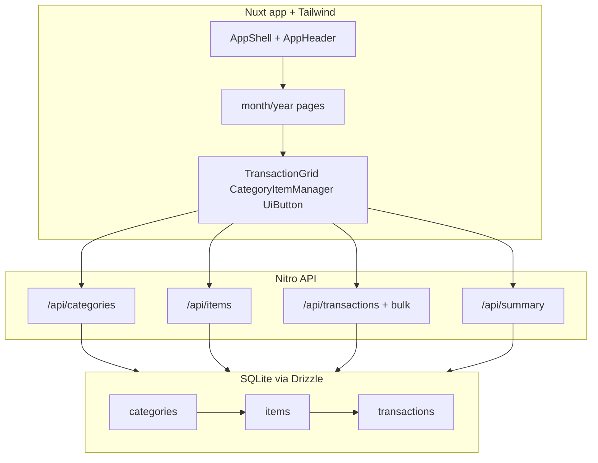

# Implementation plan: Income & expense tracker

## Goal and boundaries

Ship the approved monthly + yearly personal tracker from `docs/specs/income-expense-tracker.md` and `docs/design/income-expense-tracker.md`: type → category → item hierarchy, month-only transactions (`YYYY-MM`), bulk grid entry, category/item management, and yearly pivots.

Also establish the **first UI foundation** so later features reuse the same brand, tokens, layout, and Tailwind control language proven in `docs/prototype/`.

Non-goals unchanged: no auth, no multi-currency, no CSV, local SQLite only.

**Classification (do not re-classify):** Track C · tags `[database, ui, api]`.

## Repository findings

| Area | Finding | Evidence |
|---|---|---|
| Current branch | AIDF scaffolding + approved docs/prototype only — no application code yet | `feat/1-income-expense-tracker` worktree |
| Prior attempt | `feat/001-income-expense-tracker` has Nuxt + flat `categories`/`transactions` (day dates, no `items`) — **do not reuse schema/UI as-is**; treat as reference for Nuxt/Drizzle patterns only | prior branch `server/db/schema.ts` |
| Spec vs prior code | Spec requires `items`, month granularity, cascading Type → Category → Item | approved design + `docs/prototype/` |
| Spec wording | Spec constraints say “Nuxt 3”; this plan uses **Nuxt 4** (current stack) | assumption below |
| Design source of truth | Approved Cal monochrome prototype tokens/controls | `docs/prototype/css/styles.css` |
| Manifest commands | `install` / `lint` / `typecheck` / `test` / `build` / `migrate` / `seed` already declared | `project.yaml` |

## Architecture (target)

## UI / branding foundation (first)

Lock the design system before feature screens so every future page inherits it:

1. **Tailwind CSS** via `@nuxtjs/tailwindcss` (project CSS framework — required).
2. **Brand**: product name **Income & Expense Tracker**; Cal Sans (display) + Inter (UI body); charcoal/paper monochrome; income green / expense red for money only; link/focus blue sparingly; **no purple gradients / glass glow**.
3. **Tokens** in `app/assets/css/main.css` (CSS variables from prototype) + Tailwind theme mapping (`colors.ink`, `paper`, `income`, `expense`, `radius`, `shadow.ring`, control height `2.25rem`).
4. **Shared primitives** (foundation for future features):
   - `app/layouts/default.vue` — full-width page shell with horizontal padding, page background
   - `app/components/AppHeader.vue` — brand-forward title + This month / This year
   - `app/components/ui/UiButton.vue` — variants: `secondary` / `primary` / `quiet` / `icon` (same height/radius)
   - `app/components/ui/UiSurface.vue`, `UiMetric.vue`, `UiTypePill.vue`
5. **Conventions** update in `docs/conventions.md`: entry points, UI component path, “copy UiButton not ad-hoc button classes”.
6. Feature screens **must** compose these primitives and match `docs/prototype/` flows (manage add-item-under-category, segmented month nav, bulk grid, yearly pivots).

## Change map

| File or area | Change | Why |
|---|---|---|
| `package.json`, `nuxt.config.ts`, `tailwind.config.ts`, `app/assets/css/main.css` | Scaffold Nuxt 4 + Tailwind + fonts | App + CSS foundation |
| `app/layouts/default.vue`, `app/components/AppHeader.vue`, `app/components/ui/*` | Brand shell + shared controls | Reusable UI foundation |
| `docs/conventions.md` | Document stack, tokens, UI patterns | Future agents follow brand |
| `server/db/schema.ts`, `drizzle/`, `server/db/client.ts`, `server/db/seed.ts` | `categories`, `items`, `transactions` + seed | Spec data model |
| `server/utils/validation.ts`, `server/utils/aggregate.ts` | Zod + year/month pivots | API validation + summary math |
| `server/api/categories/*`, `server/api/items/*` | List/create/archive category & item | Spec manage panel |
| `server/api/transactions/*`, `bulk.post.ts` | List/create/edit/delete + partial bulk | Spec entry |
| `server/api/summary/monthly.get.ts`, `yearly.get.ts` | Totals + income/expense pivots | Spec yearly view |
| `app/pages/index.vue`, `month/[year]/[month].vue`, `year/[year].vue` | Screens | Approved design |
| `app/components/TransactionGrid.vue`, `CategoryItemManager.vue` | Bulk grid + manage UI | Design prototype |
| `tests/**` | Vitest: validation, bulk partial fail, aggregates | Gates |

## Schema (first migration)

- **categories**: `id`, `type` (`income`\|`expense`), `name`, `archived`, `created_at`; unique `(type, name)`
- **items**: `id`, `category_id` → categories, `name`, `archived`, `created_at`; unique `(category_id, name)`
- **transactions**: `id`, `item_id` → items, `type` (denormalized, must match item’s category type), `amount_cents` (positive int), `month` (`YYYY-MM` text), `note` nullable, `created_at`

Seed matches design starter set (Interest / Utilities / LOC categories with zero starter items allowed).

## Sequence

1. Scaffold Nuxt 4 + Tailwind + ESLint/TS/Vitest; wire `project.yaml` scripts; add CSS tokens + fonts + `default` layout + `AppHeader` + `UiButton` / `UiSurface` / `UiMetric` / `UiTypePill`.
2. Update `docs/conventions.md` with orientation + UI reference implementations.
3. Define Drizzle schema (categories / items / transactions), generate migration, migrate + seed scripts.
4. Validation + category/item APIs; unit tests.
5. Transaction + bulk + summary APIs; unit tests for partial bulk failure and yearly pivot math (including zero-item category subtotals).
6. Monthly page: metrics, `CategoryItemManager`, `TransactionGrid`, transaction list — using shared UI only.
7. Yearly page: month summary + income/expense pivots.
8. Local gates: `lint`, `typecheck`, `test`, `build`; update project-state; prepare PR template body when ready to ship.

## Data and migration

First versioned forward-only Drizzle migration. No production data. Rollback = fresh local DB + prior migration files. No backfill.

## Verification plan

- Unit: `npm run test` — Zod rules, bulk mixed valid/invalid, monthly totals, yearly pivot reconciliation
- Static: `npm run lint`, `npm run typecheck`
- Build: `npm run build`
- Manual: `npm run db:migrate && npm run db:seed && npm run dev` — exercise prototype scenarios (add item under category, cascade selectors, archive exclusion, year pivots)

## Risks and assumptions

- Assumption: Greenfield app on this branch; prior `feat/001` is pattern reference only (wrong domain model).
- Assumption: Nuxt 4 is acceptable despite spec text saying Nuxt 3.
- Assumption: Amounts stored as integer cents.
- Assumption: Category type immutable after create; item inherits type via category.
- Risk: Bulk partial-success easy to get wrong; mitigation: dedicated tests before UI.
- Risk: UI drift from prototype; mitigation: code shared primitives first and check against `docs/prototype/`.

## Completion checklist

- [x] Scope matches approved spec + design
- [x] Tailwind + brand tokens + shared UI primitives landed first
- [x] Schema includes `items`; transactions are month-scoped
- [x] Tests added or updated
- [x] Verification commands recorded
- [x] Conventions updated
- [x] Documentation decision made
- [x] PR evidence prepared

## Approval

- Decision: `approved`
- Approver: prishanf
- Date: 2026-07-26
- Notes: Approved to proceed with `/build`. Includes UI foundation (Tailwind + brand tokens + shared primitives) before feature screens.

## Agent instruction

For Track B and Track C changes, do not begin implementation until `Approval.decision` is `approved`. If repository inspection during build contradicts the approved spec or design, or reveals the change needs a higher track, stop and return to the spec before continuing.
