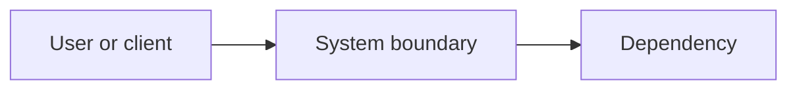

# <System or boundary name>

## Purpose

<What this part of the system is responsible for.>

## Context

## Components

| Component | Responsibility | Interface |
|---|---|---|
| <component> | <responsibility> | <API, event, or file> |

## Data flow

<Describe the important request, event, or data flows.>

## Invariants

- <rule that must remain true>

## Operational concerns

- Availability: <expectation>
- Observability: <logs, metrics, alerts>
- Security: <trust boundaries and controls>
- Recovery: <failure and rollback behavior>

## Related decisions

- <ADR link>
