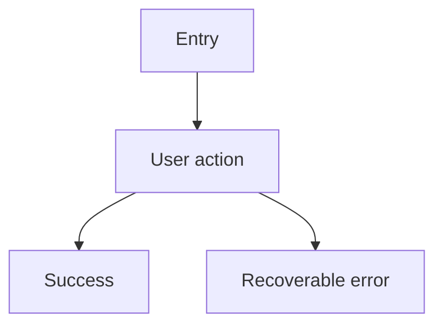

# Design: <experience>

## User goal

<What the user is trying to accomplish.>

## Flow

## States

| State | User sees | Available actions |
|---|---|---|
| Empty | <message> | <action> |
| Loading | <indicator> | <action or wait> |
| Success | <result> | <next actions> |
| Error | <plain-language explanation> | <recovery> |

## Accessibility and compatibility

- Keyboard: <behavior>
- Screen reader: <labels and announcements>
- Responsive behavior: <breakpoints or adaptation>
- Localization: <text, dates, numbers>

## Acceptance notes

- [ ] <observable interaction>
